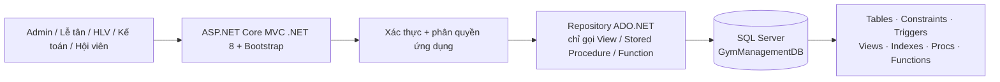
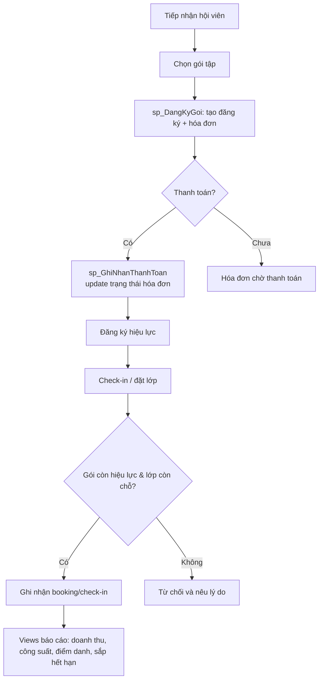
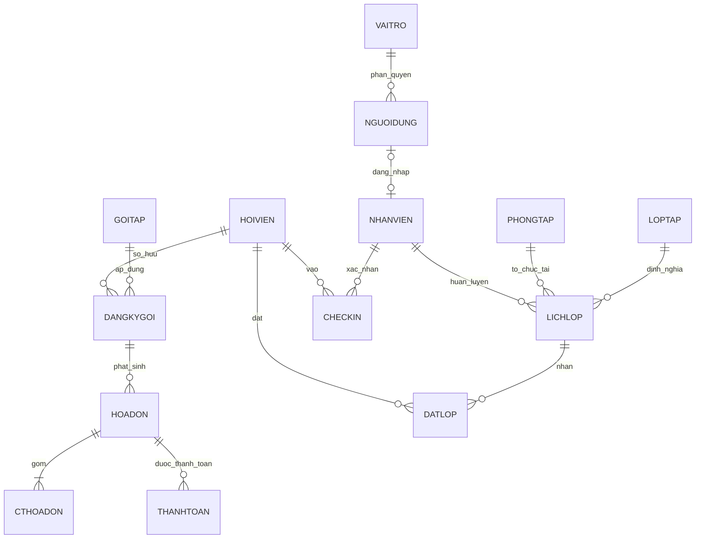

# Kiến trúc và logic tổng thể

## 1. Bài toán và ranh giới

Phòng gym cần một nguồn dữ liệu thống nhất để nhân viên tiếp nhận hội viên, bán/ gia hạn gói tập, thu tiền, sắp lớp, nhận đặt chỗ và kiểm soát lượt vào. Quản lý cần nhìn được doanh thu, số hội viên còn hiệu lực, công suất lớp và lịch sử điểm danh. 

V1 tập trung một cơ sở gym, thanh toán được nhân viên xác nhận (tiền mặt/chuyển khoản/thẻ mô phỏng), không tích hợp cổng thanh toán hay khóa cửa vật lý. Check-in được thực hiện bởi lễ tân từ mã hội viên. Chọn phạm vi này để mọi chức năng có thể demo trực tiếp với SQL Server.

## 2. Kiến trúc kỹ thuật

- Chuỗi kết nối đặt trong Secret Manager/biến môi trường; appsettings mẫu không chứa mật khẩu.
- DDL và logic SQL là nguồn chuẩn, chạy lại được từ `database/` trên SQL Server.
- Các thao tác ghi nghiệp vụ đi qua Stored Procedure; giao diện không tự ghép SQL ghi dữ liệu.
- Lỗi SQL được bắt tại procedure bằng `TRY...CATCH`, trả lỗi nghiệp vụ rõ ràng; app hiển thị thông báo an toàn và log lỗi kỹ thuật.

## 3. Luồng nghiệp vụ chính

### Use cases phải demo

| Nhóm | Chức năng/tiêu chí nghiệm thu |
|---|---|
| Hội viên & gói tập | CRUD hồ sơ, CRUD gói, đăng ký/gia hạn, xem ngày hết hạn và trạng thái |
| Thu phí | tạo hóa đơn, ghi thanh toán, không cho số tiền vượt dư nợ, xem lịch sử |
| Vận hành lớp | CRUD phòng/HLV/lớp/lịch, đặt/hủy chỗ, chặn trùng lịch và vượt sức chứa |
| Check-in | kiểm tra gói đang hiệu lực, không ghi trùng cùng ngày, lưu lịch sử |
| Báo cáo | doanh thu theo khoảng thời gian, hội viên sắp hết hạn, công suất lớp, điểm danh |
| Bảo mật | login; menu và dữ liệu đúng quyền; minh họa `GRANT`, `REVOKE`, `DENY` |

## 4. Mô hình dữ liệu chuẩn hóa 3NF

Các thuộc tính đa trị và giá trị dẫn xuất tách ra bảng riêng: một hóa đơn có nhiều dòng chi tiết/thanh toán, một lớp có nhiều buổi lịch và một hội viên có nhiều đăng ký/lần vào. Không lưu `tuổi`, `số chỗ còn lại`, `tổng chi` như dữ liệu gốc; chúng được tính qua function/view.

| Bảng | Khóa chính | Khóa ngoại / ý nghĩa |
|---|---|---|
| `VaiTro` | `RoleId` | Danh mục 5 role hệ thống |
| `NguoiDung` | `UserId` | `RoleId`; tài khoản đăng nhập, hash mật khẩu |
| `NhanVien` | `EmployeeId` | `UserId` (nullable/unique); nhân sự, HLV/lễ tân/kế toán |
| `HoiVien` | `MemberId` | hồ sơ và mã check-in duy nhất |
| `GoiTap` | `PlanId` | giá, thời lượng ngày, quyền tham gia lớp |
| `DangKyGoi` | `MembershipId` | `MemberId`, `PlanId`; khoảng hiệu lực của gói |
| `HoaDon` | `InvoiceId` | `MembershipId`, `CreatedBy`; trạng thái công nợ |
| `CTHoaDon` | `InvoiceDetailId` | `InvoiceId`; từng hạng mục và đơn giá tại thời điểm bán |
| `ThanhToan` | `PaymentId` | `InvoiceId`, `ReceivedBy`; số tiền/phương thức/ngày nhận |
| `PhongTap` | `RoomId` | tên phòng và sức chứa |
| `LopTap` | `ClassId` | loại lớp, mô tả, thời lượng chuẩn |
| `LichLop` | `SessionId` | `ClassId`, `RoomId`, `TrainerId`; buổi cụ thể và sức chứa |
| `DatLop` | `BookingId` | `MemberId`, `SessionId`; trạng thái đặt/hủy/đã tham gia |
| `CheckIn` | `CheckInId` | `MemberId`, `EmployeeId`; lượt vào gym/lớp |

## 5. Gói đối tượng SQL có ý nghĩa nghiệp vụ

| Hạng mục | Danh sách dự kiến (tối thiểu rubric: 5) |
|---|---|
| Constraint | `UQ_NguoiDung_Username`, `UQ_HoiVien_Ma`, `CK_GoiTap_Gia`, `CK_DangKyGoi_Ngay`, `CK_ThanhToan_SoTien`, `DF_*` trạng thái/ngày tạo |
| Trigger | chặn check-in gói hết hạn; chặn booking vượt sức chứa; chặn trùng lịch phòng/HLV; cập nhật tổng hóa đơn khi chi tiết đổi; cập nhật trạng thái hóa đơn khi thanh toán; audit thay đổi trạng thái đăng ký |
| View | `vw_HoiVienConHieuLuc`, `vw_DoanhThuTheoNgay`, `vw_CongSuatLop`, `vw_LichSuDiemDanh`, `vw_HoaDonConNo`, `vw_HoiVienSapHetHan` |
| Index | `IX_DangKyGoi_Member_Status_EndDate`, `IX_ThanhToan_Invoice_PaidAt`, `IX_LichLop_Room_StartAt`, `IX_DatLop_Session_Status`, `IX_CheckIn_Member_CheckedAt` + PK clustered; đo trước/sau bằng actual execution plan/STATISTICS IO |
| Procedure | `sp_DangKyGoi`, `sp_GhiNhanThanhToan`, `sp_DatLop`, `sp_HuyDatLop`, `sp_CheckInHoiVien`, `sp_BaoCaoDoanhThu` |
| Function | `fn_TrangThaiGoi`, `fn_SoNgayConLai`, `fn_TuoiHoiVien`, `fn_ChoTrongLop`, `fn_TongChiHoiVien` |

## 6. Transaction, đồng thời, phân quyền

Năm nghiệp vụ dùng `SET XACT_ABORT ON`, `BEGIN TRANSACTION`, `COMMIT`/`ROLLBACK` và `TRY...CATCH`: (1) đăng ký gói+tạo hóa đơn+chi tiết, (2) ghi thanh toán+cập nhật công nợ, (3) đặt lớp có khóa chống overbooking, (4) hủy đặt lớp+cập nhật trạng thái, (5) check-in+ghi lịch sử/điểm danh booking. `sp_DatLop` khóa hàng `LichLop` bằng `UPDLOCK, HOLDLOCK`, kiểm lại số booking `Confirmed` trước khi insert. Hai cửa sổ SSMS chạy cùng tình huống cuối chỗ là bằng chứng concurrency bắt buộc.

Các role: `rl_GymAdmin` (toàn quyền), `rl_LeTan` (hội viên, đăng ký, booking, check-in qua procedure), `rl_HuanLuyenVien` (xem lịch/lớp được phân công, cập nhật điểm danh qua procedure), `rl_KeToan` (hóa đơn/thanh toán/báo cáo). Thêm `rl_HoiVien` nếu triển khai self-service. Không cấp quyền ghi trực tiếp rộng rãi vào các bảng nghiệp vụ; cấp `EXECUTE` procedure và `SELECT` view đúng vai trò.

## 7. Kiểm thử và bằng chứng bảo vệ

- Mỗi procedure có test thành công và test rollback/lỗi; lưu script và ảnh kết quả trong `tests/`/`docs/evidence/`.
- Kiểm thử quyền bằng từng login mẫu: một thao tác được phép và một thao tác bị `DENY`.
- Index: chạy cùng truy vấn trước/sau index, lưu Actual Execution Plan và `SET STATISTICS IO, TIME ON`.
- Demo: cấu hình connection string, đăng nhập, làm xuyên suốt đăng ký → thanh toán → đặt lớp → check-in → báo cáo; không dùng ảnh/dữ liệu giả thay cho kết nối trực tiếp.

